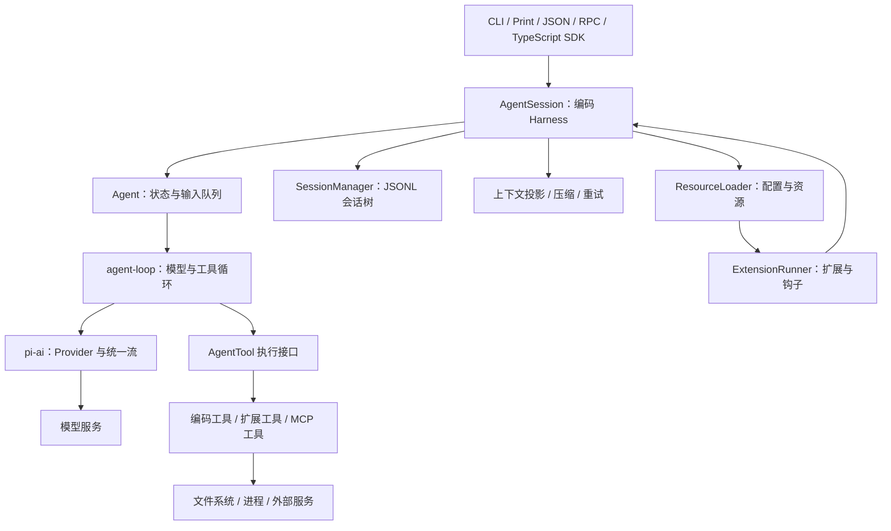
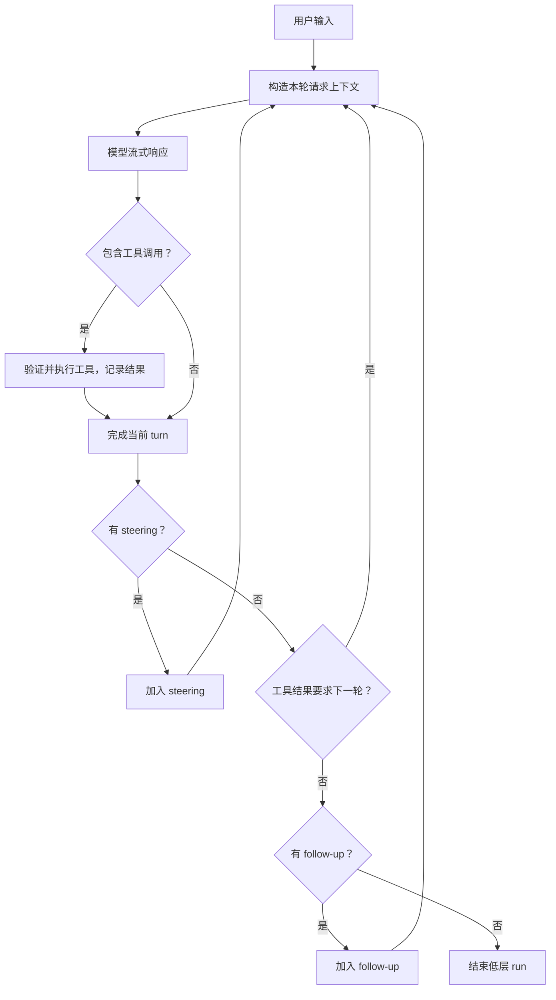
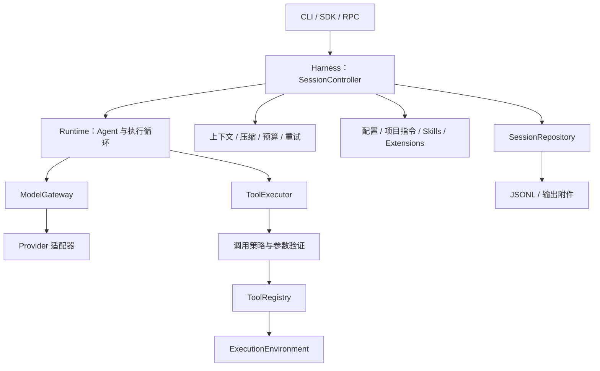
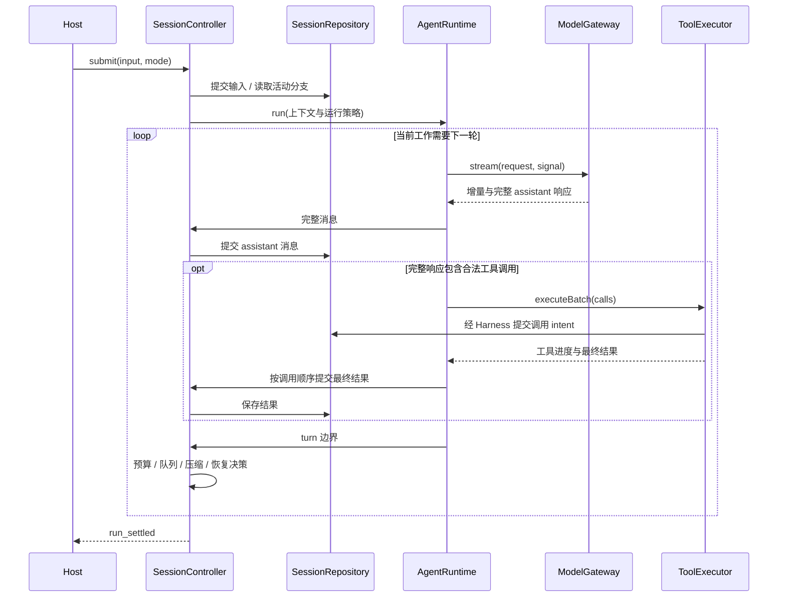

# 基于 pi Agent 的 TypeScript Code Agent 架构设计

本文先分析 pi 的实际架构，再给出本工程的架构草案。核心建议是将 **模型接入、Agent 执行循环、Harness 会话编排、工具执行环境和交互入口** 分开，使同一套运行时能够支持 CLI、SDK 和后续 Web 界面。

## 1. 范围与研究基线

| 项目 | 内容 |
| --- | --- |
| 文档状态 | 架构草案；第一版已实现模型接入、执行循环、会话编排、编码工具和 CLI，具体范围见 [实现说明](implementation.md) |
| 研究日期 | 2026-10-03，Asia/Shanghai |
| 参考项目 | [earendil-works/pi](https://github.com/earendil-works/pi)，原 `badlogic/pi-mono` 地址已重定向至此 |
| 源码快照 | [`a276dabe57911253350bffb93cb7d7aff6a73261`](https://github.com/earendil-works/pi/tree/a276dabe57911253350bffb93cb7d7aff6a73261) |
| 提交时间 | 2026-10-03 06:14:52，Asia/Shanghai |
| 版本说明 | 该快照的 `pi-ai`、`pi-agent-core`、`pi-coding-agent` 包清单均标记为 `1.0.0`；这不等同于确认已发布的 npm 版本 |

以下“pi 实现”来自该提交的官方源码与文档；“本工程建议”属于设计取舍，不代表 pi 原有行为，也不代表本工程已实现。引用固定到提交，避免主分支后续变化影响结论。

本文的架构分析聚焦 pi。第一版实现另行补充了 Hermes 工具执行模块的局部比较，见 [实现说明](implementation.md)。2026-10-04 的 [长任务处理方案](long-tasks.md) 已确认官方 `deepseek-ai/deepseek-harness` 仓库，并补充 pi、DeepSeek Harness 与 Hermes 在会话、目标、上下文和恢复方面的比较；相应设计先定义 [长任务 E2E 用例](long-tasks-e2e.md)。未覆盖的高级能力仍需按根目录 [AGENTS.md](../AGENTS.md) 继续研究。

## 2. pi 的架构分层

### 2.1 核心包与职责

pi 将通用 Agent 能力与编码应用拆成独立 TypeScript 包。主要职责如下。

| 包 / 模块 | 职责 | 架构意义 |
| --- | --- | --- |
| `pi-ai` | Provider、模型目录、认证、统一消息与流式响应、usage / cost | 隔离不同模型服务的协议差异 |
| `pi-agent-core` | `Agent` 状态、执行循环、工具调用、事件、steering / follow-up 队列、取消 | 提供通用运行时，不负责编码会话文件与终端界面 |
| `pi-coding-agent` | `AgentSession`、会话持久化、上下文投影、压缩、重试、资源与扩展、编码工具 | 构成编码应用的 Harness |
| `pi-tui` | 终端组件与渲染 | 将交互展示与 Agent 逻辑分开 |
| `pi-mcp` / `pi-codemode` | MCP 接入、通过代码调用工具 | 通过扩展接入编码应用的能力层 |
| `pi-durable` | 持久化 conversation、task、document 与恢复执行 | 独立的实验性 durable Harness 路线 |
| `chord` | 服务、状态、RPC 与插件的应用组合运行时 | 支撑更广泛的应用组合；也是 `pi-durable` 的依赖 |

来源：[仓库说明](https://github.com/earendil-works/pi/blob/a276dabe57911253350bffb93cb7d7aff6a73261/README.md)、[pi-ai](https://github.com/earendil-works/pi/blob/a276dabe57911253350bffb93cb7d7aff6a73261/packages/ai/README.md)、[Agent 核心](https://github.com/earendil-works/pi/blob/a276dabe57911253350bffb93cb7d7aff6a73261/packages/agent/README.md)、[chord](https://github.com/earendil-works/pi/blob/a276dabe57911253350bffb93cb7d7aff6a73261/packages/chord/README.md)。

### 2.2 编码应用的主干

下面表示职责关系，省略非核心依赖和部分辅助服务。



`createAgentSession()` 是装配入口：创建或接收模型运行时、设置、会话管理器和资源加载器，恢复会话上下文，创建 `Agent`，再包装成 `AgentSession`。交互模式与其他入口复用这些会话机制。

`AgentSessionRuntime` 进一步管理新建、切换、fork 和导入会话。切换会替换当前 `AgentSession`，宿主需要重新绑定订阅。

来源：[SDK 工厂源码](https://github.com/earendil-works/pi/blob/a276dabe57911253350bffb93cb7d7aff6a73261/packages/coding-agent/src/core/sdk.ts)、[SDK 文档](https://github.com/earendil-works/pi/blob/a276dabe57911253350bffb93cb7d7aff6a73261/packages/coding-agent/docs/sdk.md)、[会话运行时](https://github.com/earendil-works/pi/blob/a276dabe57911253350bffb93cb7d7aff6a73261/packages/coding-agent/src/core/agent-session-runtime.ts)。

### 2.3 模型层：Provider 与协议实现分离

`pi-ai` 的 `Models` 集合持有 Provider，并把请求路由到模型所属的 Provider。Provider 管理模型目录、认证和流行为；多个 Provider 可以共享同一种 API 协议实现。

这意味着“支持一家模型服务”和“实现一种新协议”是两种不同工作。上层运行时处理统一消息、工具调用、流事件和结束原因，协议差异在模型层解决。

当前版本还把 system prompt 与工具声明表达为 transcript 中的 system message。后续 system message 可以更新命名 prompt section 或工具集合；Provider 适配层根据模型能力保留这些更新，或折叠为有效的前置 system message。

来源：[pi-ai 的 Provider 与 System Messages 说明](https://github.com/earendil-works/pi/blob/a276dabe57911253350bffb93cb7d7aff6a73261/packages/ai/README.md)。

## 3. pi 的执行循环

### 3.1 Agent、turn 与 run

`Agent` 管理可变状态、订阅、输入队列和取消；`agent-loop.ts` 实现模型与工具的循环。一个 **turn** 包含一次模型响应及其工具结果；一个 **run** 可以包含多个 turn，直到当前工作与自动续接结束。

主要流程如下：

1. 接收用户输入，将选中的输入消息加入上下文并发送消息事件。
2. 在 `prepareRequest` 边界准备最终请求上下文。
3. 执行 `transformContext`，再通过 `convertToLlm` 转为模型消息。
4. 调用模型并消费流，产生 assistant 消息更新与完成事件。
5. 从完整响应中提取工具调用，验证参数、执行工具、生成结果。
6. 执行 `finishTurn`，发送 `turn_end`。
7. 根据工具结果、steering、follow-up 或显式继续决定下一次请求。

下面是常见路径，省略特殊终止钩子与错误恢复。



源码采用内外两层循环：内层处理工具反馈和 steering，外层在自然结束时检查 follow-up。工具失败通常转成 `isError` 工具结果，由模型决定如何修正；模型 error / aborted 响应结束当前低层 run。

来源：[执行循环源码](https://github.com/earendil-works/pi/blob/a276dabe57911253350bffb93cb7d7aff6a73261/packages/agent/src/agent-loop.ts)、[运行时类型](https://github.com/earendil-works/pi/blob/a276dabe57911253350bffb93cb7d7aff6a73261/packages/agent/src/types.ts)。

### 3.2 Steering、follow-up 与取消

| 操作 | pi 的语义 | 对本工程的启发 |
| --- | --- | --- |
| steering | 当前 assistant turn 及其工具调用完成后，进入下一轮 | 调整方向应在明确的执行边界生效 |
| follow-up | 当前待处理工作自然结束后进入 | 将追加任务与修改当前任务区分 |
| abort | 停止当前操作；取消传递到模型和工具 | 取消需要独立的控制通道 |

steering 不等于立即杀掉正在执行的工具。输入队列可配置逐条取出或批量取出。

低层 `agent_end` 也不等于编码会话完全结束：`AgentSession` 可能继续自动重试、压缩恢复或处理续接工作。宿主应以会话层的 `agent_settled` 或相应等待接口判断最终空闲。

来源：[Agent 队列与生命周期](https://github.com/earendil-works/pi/blob/a276dabe57911253350bffb93cb7d7aff6a73261/packages/agent/README.md)、[会话订阅与 prompting](https://github.com/earendil-works/pi/blob/a276dabe57911253350bffb93cb7d7aff6a73261/packages/coding-agent/docs/sdk.md)。

### 3.3 事件作为交互接口

pi 的关键事件包括 `agent_start/end`、`turn_start/end`、`message_start/update/end` 和 `tool_execution_start/update/end`；会话层补充压缩、重试和最终 settled 等事件。

流式增量用于展示，完整消息用于后续上下文。当前 `Agent.subscribe()` 的监听器按注册顺序等待执行，监听器可形成执行屏障。宿主若把耗时展示工作放入该路径，会影响运行时推进。

来源：[Agent 实现](https://github.com/earendil-works/pi/blob/a276dabe57911253350bffb93cb7d7aff6a73261/packages/agent/src/agent.ts)、[事件定义](https://github.com/earendil-works/pi/blob/a276dabe57911253350bffb93cb7d7aff6a73261/packages/agent/src/types.ts)。

## 4. pi 的会话、上下文与工具

### 4.1 历史记录与模型上下文分开

pi 的持久化会话使用 JSONL。条目通过 `id` 和 `parentId` 构成树，活动叶节点决定当前分支。改变活动节点可以在同一文件中继续另一条分支；fork 则创建新的会话文件。

`SessionManager` 是已完成模型上下文的权威来源。`AgentSession` 在请求前重新读取会话投影；直接替换内存中的 `agent.state.messages` 不等于替换持久化上下文。

当前快照将 system prompt section 与工具声明变更也保存为消息。上下文投影选择活动分支，并应用压缩与上下文编辑规则；原始历史可以继续保留供检查与导出。

来源：[会话格式](https://github.com/earendil-works/pi/blob/a276dabe57911253350bffb93cb7d7aff6a73261/packages/coding-agent/docs/session-format.md)、[会话管理器](https://github.com/earendil-works/pi/blob/a276dabe57911253350bffb93cb7d7aff6a73261/packages/coding-agent/src/core/session-manager.ts)、[请求上下文准备](https://github.com/earendil-works/pi/blob/a276dabe57911253350bffb93cb7d7aff6a73261/packages/coding-agent/src/core/agent-session.ts)。

### 4.2 压缩与消息转换

压缩生成摘要条目，并记录保留区间的起点 `firstKeptEntryId`。后续请求使用摘要与近期消息，原始条目仍留在会话树。压缩切点需要维护工具调用和结果的配对关系。

`AgentMessage` 可以包含应用自定义消息；`convertToLlm` 决定哪些内容送入模型。编码应用会转换 shell 执行记录、分支摘要和压缩摘要。当前原生消息包含 `system`、`user`、`assistant` 和 `toolResult`。

上下文组装、上下文压缩和长期记忆是不同职责。本轮研究确认了会话与摘要机制，不能据此将 pi 的会话持久化等同于一个独立的长期记忆检索系统。

来源：[压缩设计](https://github.com/earendil-works/pi/blob/a276dabe57911253350bffb93cb7d7aff6a73261/packages/coding-agent/docs/compaction.md)、[消息转换源码](https://github.com/earendil-works/pi/blob/a276dabe57911253350bffb93cb7d7aff6a73261/packages/coding-agent/src/core/messages.ts)。

### 4.3 工具接口与并发语义

工具定义包含名称、描述、参数 schema 和执行函数；执行可以发送进度，并返回供模型阅读的 `content` 与供应用使用的 `details`。

当前核心默认 `parallel`：顺序执行预检查，获准的工具并行执行；完成事件按实际完成时间发送，最终 `toolResult` 消息按 assistant 原始调用顺序排列。若批次中任一工具声明 `executionMode: "sequential"`，整个批次串行。

`beforeToolCall` 位于参数验证之后，可阻止调用；`afterToolCall` 可处理最终结果。对于因输出长度限制而截断的 assistant 消息，循环为其中工具调用生成失败结果，避免执行可能不完整的参数。

来源：[工具调度与验证源码](https://github.com/earendil-works/pi/blob/a276dabe57911253350bffb93cb7d7aff6a73261/packages/agent/src/agent-loop.ts)、[工具契约](https://github.com/earendil-works/pi/blob/a276dabe57911253350bffb93cb7d7aff6a73261/packages/agent/src/types.ts)。

编码应用的默认工具集合是 `read`、`bash`、`edit`、`write`；工具注册表还提供 `grep`、`find`、`ls` 和 `powershell`，实际启用集合可配置。同一路径的文件修改通过进程内队列串行化；这不构成跨进程锁，也不能覆盖任意 shell 命令产生的写入。

来源：[默认配置](https://github.com/earendil-works/pi/blob/a276dabe57911253350bffb93cb7d7aff6a73261/packages/coding-agent/src/core/settings-manager.ts)、[工具注册表](https://github.com/earendil-works/pi/blob/a276dabe57911253350bffb93cb7d7aff6a73261/packages/coding-agent/src/core/tools/index.ts)、[文件修改队列](https://github.com/earendil-works/pi/blob/a276dabe57911253350bffb93cb7d7aff6a73261/packages/coding-agent/src/core/tools/file-mutation-queue.ts)。

## 5. pi 的扩展与运行边界

### 5.1 Extensions 与 Skills

Extensions 是加载进 pi 进程的 TypeScript 模块，工厂函数注册工具、命令、Provider、事件处理器和 UI 等能力。资源加载器与扩展运行器负责发现、加载和生命周期。

Skills 提供任务指导与支持文件：启动时向模型提供名称、描述和位置，需要时再读取完整 `SKILL.md`。Prompt templates 复用输入文本；themes 管理终端展示；Pi packages 分发这些资源。

本工程可借鉴这种职责区分：流程指导放入 skill，可执行能力通过扩展注册，通用循环保留在 runtime 中。

来源：[扩展文档](https://github.com/earendil-works/pi/blob/a276dabe57911253350bffb93cb7d7aff6a73261/packages/coding-agent/docs/extensions.md)、[Skills 文档](https://github.com/earendil-works/pi/blob/a276dabe57911253350bffb93cb7d7aff6a73261/packages/coding-agent/docs/skills.md)、[资源加载器](https://github.com/earendil-works/pi/blob/a276dabe57911253350bffb93cb7d7aff6a73261/packages/coding-agent/src/core/resource-loader.ts)。

### 5.2 当前 MCP 接入方式

该快照的 CLI 将 MCP、codemode 和 tool_search 作为内置扩展加载。SDK 会话不会自动装配这些扩展，需要宿主显式加入。MCP 不是 `pi-agent-core` 的执行循环职责。

因此，描述当前 pi 时不能沿用早期“没有内置 MCP”的笼统结论。对本工程而言，MCP 可作为工具来源适配器接入统一注册表，而无须修改循环。

来源：[SDK 的 Codemode 与 MCP 说明](https://github.com/earendil-works/pi/blob/a276dabe57911253350bffb93cb7d7aff6a73261/packages/coding-agent/docs/sdk.md)、[MCP 文档](https://github.com/earendil-works/pi/blob/a276dabe57911253350bffb93cb7d7aff6a73261/packages/coding-agent/docs/mcp.md)。

### 5.3 Project trust 与执行权限

pi 的 project trust 控制部分项目设置与资源是否加载。启用的工具和进程内扩展仍使用 pi 进程的操作系统权限；工作目录不是文件访问边界，扩展钩子也不是操作系统沙箱。

本工程应分别设计资源加载信任、调用策略与执行环境，避免把三者合并成一个配置开关。

来源：[pi 安全模型](https://github.com/earendil-works/pi/blob/a276dabe57911253350bffb93cb7d7aff6a73261/packages/coding-agent/docs/security.md)。

### 5.4 独立的 pi-durable 路线

当前仓库另有实验性的 `pi-durable`。它将输入、生成和工具任务纳入持久化状态机，支持存储后观察、恢复和带 request ID 的重复提交识别。工具调用中途崩溃后是否重放取决于工具声明的 replay 策略。

它与上面分析的 `AgentSession + SessionManager` 是不同的装配路线；当前 `pi-coding-agent` 包清单没有依赖 `pi-durable`。JSONL 保存对话本身也不能自动提供 durable task 语义。

本工程首版采用简单会话 Harness；若后续明确需要后台任务与进程崩溃后自动恢复，再评估 durable 设计，尤其是副作用重放语义。

来源：[pi-durable 官方说明](https://github.com/earendil-works/pi/blob/a276dabe57911253350bffb93cb7d7aff6a73261/packages/durable/README.md)、[coding-agent 依赖清单](https://github.com/earendil-works/pi/blob/a276dabe57911253350bffb93cb7d7aff6a73261/packages/coding-agent/package.json)。

## 6. 本工程建议架构

### 6.1 模块划分与依赖方向

首版建议采用单个 TypeScript 项目、按职责分目录。接口稳定且出现独立发布需求后，再拆成 workspace packages。

```text
src/
  contracts/       消息、事件、模型、工具、会话的共享契约
  model/           ModelGateway、Provider 适配与凭据解析
  runtime/         Agent 状态、执行循环、输入队列与取消
  harness/         SessionController、上下文、压缩、重试与运行预算
  tools/           注册表、参数验证、工具调度与基础编码工具
  environment/     文件与进程执行适配器、执行环境约束
  resources/       AGENTS.md、skills、prompt templates 与配置发现
  extensions/      扩展注册、生命周期与能力装配
  storage/         会话日志、分支索引、输出附件与迁移
  hosts/
    cli/           命令行输入与事件展示
    rpc/           后续的跨进程协议入口
    sdk/           程序内调用入口
docs/
  architecture.md 本文
```

这些目录是建议结构，本次只创建文档。`contracts` 不依赖 Node 文件系统或 Provider SDK；`runtime` 通过契约调用模型和工具；`harness` 装配运行时与服务；`hosts` 使用 Harness 的公开接口。



同一会话同一时刻只允许一个活动 run。多个宿主连接同一会话时，由会话所有者统一接收命令和分发事件，不让多个运行时分别修改同一份会话日志。

### 6.2 关键边界

| 模块 | 必须负责 | 交给其他模块 |
| --- | --- | --- |
| `ModelGateway` | 标准请求、标准流、能力查询、错误归一化 | 工具执行与会话写入 |
| `AgentRuntime` | turn 循环、消息与工具结果推进、取消边界 | 文件发现、持久化、终端展示 |
| `SessionController` | 会话命令、单写者、输入队列、恢复、最终 settled | Provider 原始协议 |
| `ContextBuilder` | 活动分支投影、指令装配、摘要与消息转换 | 修改原始历史 |
| `ToolExecutor` | schema 验证、策略、并发、输出限制、错误结果 | 根据工具输出自行完成用户任务 |
| `ExecutionEnvironment` | 文件与进程操作、路径解析、进程树取消 | Prompt 与模型协议 |
| `ResourceLoader` | 按作用域发现配置、指令、skills 和扩展 | 执行 Agent 循环 |
| `SessionRepository` | 日志、活动分支、版本、提交与恢复读取 | 调用模型 |

运行时读取历史与内存状态必须有清晰归属：存储层拥有已提交历史，runtime 拥有本轮临时状态，ContextBuilder 生成请求投影。临时流片段不得直接当作下一轮的已完成消息。

### 6.3 TypeScript 契约草案

以下为本工程自行定义的接口示意，采用文本内容作为首版范围。名称与字段不要求兼容 pi；图片、thinking 与 Provider 专有内容在能力扩展时增加明确的 content block 类型。

```typescript
export interface ToolCall {
  id: string;
  name: string;
  arguments: unknown;
}

export interface AssistantMessage {
  role: "assistant";
  text: string;
  toolCalls: readonly ToolCall[];
  stopReason: "stop" | "tool_calls" | "length";
}

export type ModelMessage =
  | { role: "system" | "user"; text: string }
  | AssistantMessage
  | { role: "tool_result"; callId: string; text: string; isError: boolean };

export interface ToolDescriptor {
  name: string;
  description: string;
  parameters: Readonly<Record<string, unknown>>;
}

export interface ModelRequest {
  model: { provider: string; id: string };
  messages: readonly ModelMessage[];
  tools: readonly ToolDescriptor[];
  maxOutputTokens?: number;
}

export interface ModelCapabilities {
  supportsTools: boolean;
  supportsStreaming: boolean;
  contextWindow: number;
}

export type ModelEvent =
  | { type: "text_delta"; delta: string }
  | { type: "tool_arguments_delta"; callId: string; delta: string }
  | {
      type: "done";
      message: AssistantMessage;
      usage?: { inputTokens: number; outputTokens: number };
    };

export interface ModelGateway {
  capabilities(model: ModelRequest["model"]): Promise<ModelCapabilities>;
  stream(request: ModelRequest, signal: AbortSignal): AsyncIterable<ModelEvent>;
}

export interface ToolResult {
  text: string;
  isError: boolean;
  details?: Readonly<Record<string, unknown>>;
  artifactId?: string;
}

export interface ToolContext {
  callId: string;
  workspaceId: string;
  signal: AbortSignal;
  environment: ExecutionEnvironment;
  reportProgress(text: string): Promise<void>;
}

export interface ExecutionEnvironment {
  readFile(path: string, signal: AbortSignal): Promise<string>;
  writeFile(path: string, content: string, signal: AbortSignal): Promise<void>;
  runCommand(
    command: string,
    options: { shell: "powershell" | "bash"; cwd: string; signal: AbortSignal },
  ): Promise<{ stdout: string; stderr: string; exitCode: number }>;
}

export interface AgentTool<TArgs> extends ToolDescriptor {
  effect: "read" | "write" | "process" | "network";
  concurrency: "parallel_safe" | "sequential";
  replay: "safe" | "never";
  validate(input: unknown): TArgs;
  execute(args: TArgs, context: ToolContext): Promise<ToolResult>;
}
```

契约约定：Provider 在一次成功响应中必须产生且只产生一个 `done`；异常与取消由适配器抛出标准错误，由 Harness 决定恢复。`length` 响应中的工具调用不得执行。流式参数片段只用于展示，工具只能接收完整响应中经过验证的参数。

schema 与 `TArgs` 应由同一 schema 定义生成，避免手写类型与运行时验证规则分歧。具体 schema 库尚未确定；pi 的 TypeBox 用法提供了一个参考。

## 7. 本工程的运行与数据设计

### 7.1 一次请求的时序



图中的工具 intent 写入是 Harness 提供给 ToolExecutor 的提交能力，不让工具实现直接依赖 JSONL 文件。首版完整消息与最终结果提交成功后，才广播对应的 committed 事件；流式展示事件使用单独的临时通道。

### 7.2 会话记录与上下文投影

建议日志头保存 `schemaVersion`、`sessionId`、`workspaceId` 和创建时间。树条目保存 `id`、`parentId`、`timestamp`、`kind` 与相应 payload。

| 条目种类 | 保存内容 | 是否直接参与模型上下文 |
| --- | --- | --- |
| `message` | system / user / assistant / tool_result | 是，按投影规则处理 |
| `configuration` | 模型选择、工具集、有效指令版本 | 转换成请求配置或 system 内容 |
| `tool_intent` | call ID、工具版本、验证后的参数、重放策略 | 否；用于恢复和审计 |
| `compaction` | 摘要、保留起点、摘要来源边界 | 是，以摘要替换旧区间 |
| `branch_selection` | 活动分支变更 | 否；决定投影路径 |
| `run_status` | 运行、取消、失败、最终空闲 | 否 |
| `extension_state` | 带命名空间的扩展状态 | 默认否，需显式转换 |

会话默认保存到用户数据目录，按 workspace 分组；具体路径由配置注入。完整的大型工具输出保存为附件，模型上下文保留截断内容与附件引用。凭据由模型层解析，不写入会话配置。

投影应保留当前用户意图、有效指令、最近消息和成对的工具调用 / 结果。压缩保留任务约束、已完成修改、验证结果、未完成事项和关键文件位置。压缩摘要不能替代实际代码、测试输出与文件读取。

会话分支表示对话路线，文件修改仍由执行环境完成；切换对话分支不自动回滚工作区。若需要代码状态分叉，应另行与 Git worktree 或快照能力结合。

### 7.3 并发、重试与崩溃恢复

首版工具默认串行；明确无副作用且声明 `parallel_safe` 的独立读取，可在后续启用有界并行。结果写入保持调用顺序，进度按完成时间发送。同一路径写入采用规范化路径锁；shell 命令默认串行，不依赖文件工具锁保护它的任意副作用。

重试分层处理：模型适配器识别可重试传输错误，Harness 控制总次数与退避；上下文超限进入压缩恢复；工具失败返回结构化错误，不默认重跑有副作用的工具。共享重试预算，避免适配器和 Harness 各自无限重试。

工具错误应包含明确的错误码，例如参数验证失败、策略拒绝、超时、取消、执行失败或中断。缺少工具、参数非法与调用被拒绝同样需要生成与 call ID 配对的结果，以保持下一轮模型上下文完整。

执行前记录 tool intent，完成后记录 outcome。重启时若只有 intent 而没有结果，则实际副作用未知：只有声明为可安全重放且满足相应条件的工具可重新执行，其余标记为 interrupted，并保留恢复信息。日志不能保证外部副作用的 exactly-once。

首版支持读取历史并识别中断状态，不承诺自动恢复所有后台任务。日志采用单写者；必须定义尾部不完整记录的恢复规则、写入错误处理和分支指针恢复。更强的断电持久性需要明确 flush / fsync 策略。

### 7.4 取消与最终结束

每个 run 拥有独立 `AbortController`，信号传递到模型流、排队工具与执行环境。取消 shell 时，执行环境处理已启动的进程树；取消完成后不得启动该 run 的新工具。

Harness 维护最大 turn 数、工具调用次数、请求超时、总运行时长和可选 token / 成本预算。达到限制后以 `budget_exhausted` 结束并保存未完成状态。usage 不可用时记录为未知，不能按零消耗处理；运行预算不替代进程和工具的独立超时。

本工程事件分为请求 / turn、临时流、已提交消息、工具、压缩 / 重试和最终 `run_settled`。每个事件携带 `sessionId`、`runId` 和递增序号；工具事件额外携带 `callId`。重试 attempt 结束与整个 run 最终 settled 使用不同事件。

持久化与关键状态处理器在内部执行路径中等待完成；UI 订阅通过有界队列消费，避免慢客户端阻塞 Agent。队列溢出后发送状态快照，使客户端能够重新同步。

### 7.5 资源与执行环境

项目指令、用户配置、skills 与扩展按作用域加载，记录来源与版本。输入中引用的文件、工具输出和外部内容保留来源标签；这些内容不能自行提升权限或改写宿主策略。

工具调用策略接收工具名、已验证参数、工作区与权限配置，返回允许、拒绝或需要宿主决策。策略结果需要可解释且可记录；普通低风险操作是否需要交互由用户配置决定。

资源信任决定能否加载可执行扩展；调用策略决定能否执行某项操作；执行环境提供实际文件、进程与网络边界。Node 进程内扩展属于可信代码，若允许不可信扩展，应使用独立进程或隔离环境。

Windows 首版通过 `ExecutionEnvironment` 支持 PowerShell，其他平台支持 bash。命令携带 shell 类型和明确 cwd，不把 PowerShell 与 bash 字符串相互拼接。

## 8. 设计取舍记录

| 决策 | 参考与候选方案 | 当前建议与原因 |
| --- | --- | --- |
| D01：通用循环与 Harness 分层 | pi 的 `Agent` / `AgentSession`；单类包办全部功能 | 采用分层；便于复用、测试与替换交互入口 |
| D02：模型层复用策略 | 包装 `pi-ai`；直接嵌入完整 coding-agent SDK；自行实现全部 Provider | 优先评估在自有 `ModelGateway` 后包装 `pi-ai`；降低协议工作量并保留替换边界。正式依赖版本需单独验证与锁定 |
| D03：历史为权威来源 | pi 的 SessionManager 投影；内存消息数组为唯一状态 | 采用持久化历史与请求投影分离；避免恢复、分支和压缩相互冲突 |
| D04：初期工具并发 | pi 当前默认并行；本工程默认串行 | 首版串行，之后开放明确独立的读取并行；先确定副作用与锁的语义 |
| D05：上下文资源 | pi 的延迟加载 skills、扩展与模板 | 采用按需加载；控制上下文体积并明确能力来源 |
| D06：执行边界 | pi 的 project trust 与宿主权限；独立策略 / 环境接口 | 增加策略与环境接口；适配本地、受限目录和后续容器运行 |
| D07：Durable tasks | 实验性 `pi-durable`；简单会话日志 | 首版选择简单 Harness，保留 intent 与恢复状态；待后台任务需求明确再扩展 |
| D08：工程结构 | pi 多包 monorepo；单项目分模块 | 首版单项目，按目录隔离；避免过早引入发布与跨包版本管理 |
| D09：工作流能力 | 在核心内置 planner / 多 Agent；通过扩展与宿主组合 | 保持单 Agent 核心；MCP、任务规划与多 Agent 作为后续能力接入 |

上述为 pi 研究后的初步取舍。Hermes 与 DeepSeek Harness 的比较可能调整会话、记忆和编排部分，因此尚不将候选依赖与全部模块接口视为最终定案。

## 9. 实施顺序与验收

| 阶段 | 交付范围 | 验收重点 |
| --- | --- | --- |
| M1：通用循环 | 契约、假模型适配器、AgentRuntime、工具注册与执行、CLI 文本事件 | 多轮工具反馈正确；非法参数不执行；失败可反馈；取消后无新增调用 |
| M2：可恢复会话 | JSONL 仓库、活动分支、SessionController、输入队列 | 重启恢复已完成历史；尾部损坏可诊断；中断工具不盲目重放；steering / follow-up 顺序正确 |
| M3：真实编码能力 | 一个真实 Provider、read / write / edit / shell、输出附件、Windows 适配 | 可在临时测试仓库完成读改测；路径与并发策略有效；截断参数不执行；进程树可取消 |
| M4：上下文与扩展 | AGENTS.md、skills、摘要压缩、扩展注册、RPC / SDK | 压缩后调用与结果配对；原始历史保留；不同宿主共享同一会话语义 |
| M5：按需求扩展 | MCP、长期记忆、规划、多 Agent 或 durable tasks | 先补充多项目比较与具体设计，再验证新增能力的失败和恢复语义 |

实现时使用可控假 Provider 与临时文件系统验证循环、取消、顺序和恢复；真实模型测试单独用于协议兼容与实际任务验证。不能只验证模型最终输出文本，还需检查工具是否实际执行、文件是否正确修改、运行是否真正 settled。

## 10. 后续需要明确的架构问题

- Hermes 的会话、记忆与工具组织方式，是否需要补充本稿的上下文设计。
- DeepSeek Harness 的项目和研究提交已在 [长任务处理方案](long-tasks.md) 固定；后续扩展设计继续核对插件生命周期与兼容范围。
- 本工程是优先复用 `pi-ai`，还是因 Provider 需求选择其他模型接入方式。
- 首版是否需要跨进程共享会话、后台任务或 Web 界面；这些需求会影响存储与宿主协议。
- 工具权限配置、扩展信任来源及执行环境的部署范围。

架构收敛时应为上述问题补充参考来源与决策记录。M1 可先验证通用循环，候选依赖与高级能力保持可替换。
