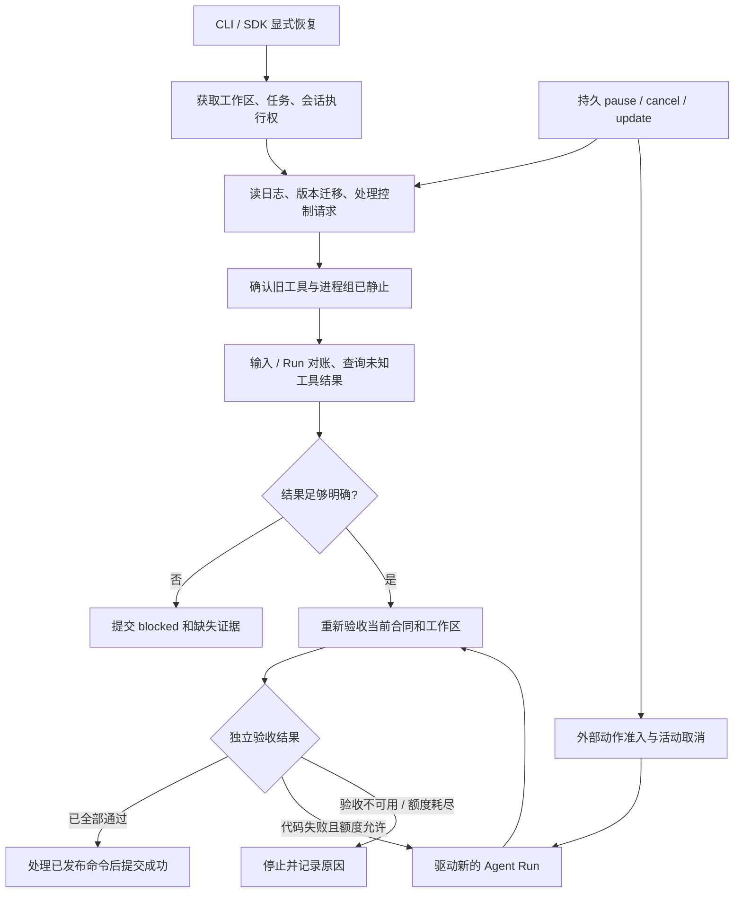

# 长任务第二阶段方案：恢复、版本与用户控制

> 当前执行平台已统一 Linux，Windows 兼容层已移除；本页保留原阶段平台与验收事实。当前验收见 [Linux-only](../../e2e/linux-only.md)。


> 历史阶段记录：下文的实现范围、限制和验收数对应其记录日期，不是当前待办清单。2026-10-05 后续实现见 [当前落地记录](../current.md) 与 [逐用例说明](../../e2e/advanced.md)；历史失败与平台报告仍保留。

日期：2026-10-04。状态：**已落地并完成 26 个 E2E 分组验收**。设计前置为 [第二阶段 E2E](../../e2e/history/recovery.md)，实际交付与保守兼容差异见 [第二阶段实现](recovery.md)。旧格式迁移仅支持具有完整未启动证据的空任务；有执行历史但证据不足的 v1 任务仍拒绝恢复。

## 1. 范围与设计依据

第二阶段让任务可靠跨进程继续：保留合同和累计用量，确认未结算工具的实际结果，重新验证当前工作区，处理持久暂停 / 取消 / 更新，并阻止多个执行者同时写入。首批针对当前 Windows、本地文件系统、单 Agent 和显式恢复，不引入后台调度服务。

本阶段继续使用宿主定义的有序阶段和独立验收。模型自主拆解任意项目、DAG 调度、上下文压缩、全局 token / 活动时间预算和无进展重规划分别保留为后续能力，不能据恢复通过就宣称已经完成。

已通过的 LT-02 暴露了两个直接约束：历史通过只属于过去的代码快照；模型需要可直接使用的失败说明，而非无法读取的私有证据路径。控制器当前提示还写死 `src`，第二阶段必须通过 LT-10 去除这一工程结构依赖。

| 当前源码事实 | 第二阶段增量 | 验证 |
| --- | --- | --- |
| [TaskRepository](../../../src/storage/task.ts) 只有 create / read，fold 仅累计历史通过 | 增加独占 open、恢复投影、当前有效证据集合 | LT-04D/E、LT-07B |
| [TaskController](../../../src/harness/task-controller.ts) 从 index 0 启动，控制状态在进程内 | 从提交事实确定下一动作，开放 resume / 控制命令 | LT-04、LT-08 |
| [AgentSession](../../../src/harness/session.ts) 有稳定 run ID，但 user message 没有 input ID | 输入接收去重与跨日志对账；任务模式先恢复后执行 | LT-04C |
| [SessionRepository](../../../src/storage/session.ts) 按 wx 文件防并发，异常退出需人工清理 | 统一执行权；旧锁不能直接按年龄删除 | LT-08C |
| [ToolExecutor](../../../src/tools/executor.ts) 先持久 intent，再执行；未提交结果统一视为未知 | 按调用身份、intent 和可信查询分类，必要时阻塞 | LT-04A/B/F |
| [LocalEnvironment](../../../src/environment/local.ts) 正常取消可停止进程树 | 托管子进程生命周期，强退后也须确认静止 | LT-08B |

## 2. 不变量与验收对应

1. **先获执行权，再修改日志或工作区**；同一 Task / Session / 规范工作区只允许一个协作执行者。对应 LT-08C。
2. **持久事实先于外部动作**；写入失败后禁止下一模型请求和工具启动，未提交状态不能当成已保存。对应 LT-04C、LT-09 写入失败变体。
3. **输入不重复接收，外部效果不承诺恰好一次**；任务和会话使用 ID 对账，未知副作用靠回执 / 当前状态确认。对应 LT-04A/B/C/F。
4. **旧证据不能授权当前成功**；成功只引用当前合同、验收清单和工作区指纹下的证据。对应 LT-04D、LT-07、LT-08D。
5. **控制投递与控制生效分开**；取消优先阻断新动作，暂停在安全边界落盘，不把投递收据当成停止结果。对应 LT-08A/B/D。
6. **恢复不刷新额度**；已经提交的 Run / repair 用量保留，新恢复执行另计 Run。对应 LT-04C、LT-08A；全局请求预算另由 LT-05 验证。
7. **通用机制不包含示例工程路径和业务公式**；路径、目标及验收说明来自合同。对应 LT-10，订单金额规则继续由订单合同持有。

## 3. 模块职责与对外接口



新增 `RecoveryPlanner` 只基于事实形成恢复动作，模型不决定原操作是否发生。`TaskCommandStore` 管投递，`TaskController` 串行处理任务事实；`OwnershipProvider` 管执行权，`ProcessSupervisor` 管进程；`AgentSession` 继续管理模型协议。

SDK 调用语义：

```typescript
const controller = await openTaskController({ taskId, dataDirectory, config, services });
// open 只打开并校验，不自动调用模型。
try {
  const result = await controller.resume();
} finally {
  await controller.close();
}

const receipt = await sendTaskCommand({
  taskId, dataDirectory,
  command: { id: commandId, type: "pause" },
});
const applied = await readTaskCommandResult({ taskId, dataDirectory, commandId });
```

`services` 是宿主注册的执行权、进程及工具查询实现，不把私有状态路径或回执写权限开放给模型。任务工具注册接口需支持 E2E 的真实审计工具；既有聊天 SDK 保持原用法。

CLI 增加 resume / pause / cancel / update / command-status，参数见 [E2E 入口](../../e2e/history/recovery.md#1-实际目标和测试入口)。status 和 command-status 不要求模型密钥；控制投递也不调用模型。resume 使用当前宿主提供的凭据，密钥不从日志恢复。有效模型 / 工具 / 权限与历史配置不兼容时阻塞，不默默切换后端或扩大权限。

## 4. 数据与存储升级

### 4.1 派生状态

v2 TaskState 增加以下语义字段，具体 TypeScript 类型在实现时以用例收敛：

| 字段 | 语义 |
| --- | --- |
| `specVersion: number` | 当前有效合同版本，不再固定为 1 |
| `status` | 增加 recovering / paused，区分用户暂停、进程中断和取消 |
| `activeRun` | run ID、input ID、原会话游标、片段是否已结算 |
| `historicalMilestones` | 历史通过线索，不能直接授权推进 |
| `validMilestoneEvidence` | 当前合同与指纹下的有效证据引用，可重建 |
| `unresolvedEffects` | 未确认调用、操作 ID、查询结果和阻塞原因 |
| `commands` | ID、内容摘要、接收序号、处理结果；从控制事实派生 |
| `usage` | 保留当前累计 runs / repairs；后续接入请求预留账本 |
| `ownership` | 本次执行者身份、代际、执行权注册目录、进程组引用 |

新增 `scope.writablePaths` 描述可写目录。新任务明确提供；迁移旧任务时不能从自然语言 constraints 自动猜出目录，采用原有工作区边界并记录 legacy 来源。收紧范围需显式更新合同。文件 write / edit 使用此范围校验；shell 的主机权限边界仍如实保留，范围声明不构成沙箱。

### 4.2 权威日志与代际

任务及会话增加 schema 2 的格式解码器。原始 v1 文件保持不变，迁移写入新代际日志；记录源文件摘要、最后有效游标和旧事件到新事件的映射，两个新日志都同步完成后才原子发布迁移 manifest。发布前崩溃的候选代际只作为孤立文件，不成为活动日志。迁移也必须持有执行权。

运行时只采用 manifest 指向的同一代际；status 可继续读取未迁移 v1。完整记录需校验类型、ID、序号、前序关联及内容摘要，拒绝未来 schema 和中间损坏。写入者仅能在备份原始尾部后修复明确的不完整最后记录，不能把一般 JSON 解码失败当成任意截断许可。

snapshot 带日志游标和摘要，仅为缓存。恢复以完整提交记录重建状态；孤立验收附件和临时迁移文件不能增加通过状态。所承诺的第一批故障模型是进程崩溃与本地文件系统，断电 / 磁盘损坏 / 网络文件系统的额外保证须另加用例，不能仅凭 fsync 字样承诺。

旧活动任务没有可靠 input ID、工具版本或进程组身份时，返回 `migration_handoff_ambiguous` 或 `process_state_unknown`。不得按相似文本推造“已接收输入”，也不得用只知道的 PID 杀进程。旧已成功 / 已取消任务保留历史查询，不因此转换为可继续任务。

### 4.3 输入交接

一次模型执行输入由控制器分配 `inputId / runId / specVersion / contentHash`：

1. 任务提交 `run_planned`，冻结本次输入并占用一个 Run 额度。
2. 会话 `acceptInputOnce()` 提交带上述关联的一条输入接收记录及模型可见 user message。重复 ID 同内容返回既有条目；不同内容冲突。
3. 任务提交 `input_applied`，引用会话条目和游标；随后才允许模型请求。
4. 会话提交 Run 结果，任务再引用该结果。任务引用丢失时可以按 run ID 补交，不能再次运行整段代码。

任务和会话不是跨文件事务。恢复按 ID 查找：会话已接收则补齐任务引用，未接收则接收一次；中断 Run 记录为 interrupted，不复用半截模型响应执行工具。需要实际继续时创建新的恢复 Run，明确关联旧 Run，另占用额度。原先预留的 Run 即使没有完成请求也不退回，以免反复强退绕过次数限制。

这保证逻辑输入交接可去重，不保证模型请求或工具外部效果恰好一次。Run 的结构化终止原因应区分 natural_stop、turn_limit、pause、cancel、interrupted、model_error、persistence_error；控制器不能把所有 aborted 都归为用户取消。

## 5. 恢复流程与工具结果

### 5.1 恢复顺序

获取执行权后，重建任务和会话；先处理待取消 / 暂停标记，确认旧托管进程静止，再对账输入、Run 和工具结果。未解决的 `effect_unknown` 是执行门禁，不能只补一句错误提示后继续让模型决定是否重复操作。

结果明确后重新检查可信验收文件、项目指令、模型 / 工具版本及源码指纹，并按当前合同运行验收：已经满足全部目标时无需再发模型请求；代码失败时反馈实际诊断，按剩余额度选择阶段；验收不可用时 blocked。最终成功仍需全量验收和控制命令提交门禁。

阶段数量和恢复起点从状态与当前验收推导，不保存一个无法核实的内存 index。第一版保守重验所有已通过阶段；复杂的依赖增量重验以后再引入。

### 5.2 调用身份与分类

intent 增加独立 `operationId`、原 assistant 条目 ID、run ID、模型 call ID、工具版本及必要的后置条件摘要。恢复用这一组身份定位，不能假设模型 call ID 在整个会话全局唯一。

| 已提交事实 | 结论 | 允许的后续动作 |
| --- | --- | --- |
| assistant 有调用、无 intent | 工具未获启动许可 | 为原调用补 not_started 结果；新决策可重新选择工具 |
| 有匹配的真实 tool_result | 结果已提交 | 保留结果，不重做原调用 |
| intent 有、结果无，可信查询得到回执 | 原效果已确认 | 验证操作 ID 和回执摘要，持久化恢复结论后补结果 |
| 单文件工具，查询确认预期内容已存在且工具影响范围明确 | 当前后置条件已满足 | 记录 observed_postcondition，不宣称原调用的完整历史回执，不重放 |
| 只读工具中断 | 可以重新读取当前状态 | 明确输出来自恢复后的读取，不伪称旧输出 |
| 写入 / shell 等效果仍不明确 | outcome_unknown | blocked，不启动后续模型或有副作用工具 |

拟增加宿主 `ToolRecoveryAdapter.inspect(intent)`，返回匹配回执、当前文件观察或 unknown。查询只能读取状态，不重做副作用；`not_started` 必须有执行契约支持，不能由“没有找到回执”推断。默认 write / edit 不自动重放；单文件后置条件核对必须在原 intent 保存预期摘要及工具版本，LT-04F 单独验证。

恢复结论先提交，再补齐模型协议结果。两者之间崩溃时按原调用身份补交一次。保留的原生 assistant `providerData` 和 call ID 不被摘要或恢复元数据改写；已存在结果不追加第二个同 call ID 的结果。旧合成中断结果若仍存在不确定性，要在独立恢复事实中保留，不能误当作真实完成回执。

无法确认的 shell 操作仍可能阻塞，这比盲目重试更符合其实际语义。用户 / 宿主补充可查询证据后可显式 resume；不提供一个无证据的“标记已执行”开关。

## 6. 控制命令与合同版本

### 6.1 发布、接收与应用

命令 envelope 包含 `id / taskId / type / payload / contentHash / expectedVersion?`。存储使用同一文件系统中的临时文件写入并同步，再无覆盖发布完整不可变文件；稳定 ID 同内容返回原收据，异内容冲突。发布序号由命令目录的短控制锁串行分配，允许崩溃留下序号空洞，不按时间戳排序。

命令状态为 queued → received → applied / rejected。文件通知仅用于唤醒；执行者定期补查，并在新模型请求、工具启动、验收和最终结算前检查。接收、应用和任务写入共用串行提交队列。

合同更新与 command applied 写成**同一条任务控制事实**，包含完整新合同 / 摘要和结果；fold 同时应用版本与命令状态。不能先改合同、稍后另写去重标记，导致崩溃后更新两次。暂停 / 取消完成同样把实际状态转换与命令处理结果一起提交。

无活动执行者时，CLI 可获取执行权运行仅处理控制的短生命周期宿主；它不调用模型。涉及旧进程或未知效果时先完成必要核查，不能只改状态文件宣称已经停止。resume 是启动执行者的入口，获取执行权后记录显式恢复意图；正在执行时另一个 resume 返回 busy，不另排一个并发 Run。

### 6.2 暂停与取消

pause 收到后停止下一片段准入，允许当前已提交 assistant 的工具批次在超时内结算；完整工具组提交、托管子进程静止后进入 paused。用户需要立即停止时使用 cancel。pause 的等待超时不撤回持久命令，也不能返回“已暂停”。

cancel 接收并同步后优先触发 AbortController 和托管进程组停止；之后每个外部动作入口都检查持久停止标记。进程清理结束后进入 cancelled，保存未解决调用和已发生效果；取消不回滚已有文件修改。若清理无法确认，保留 cancel_requested 与明确阻塞，不能伪造已停止收据。重启优先完成取消，不启动模型。

Ctrl+C 走同一持久取消协议。若接收记录写入失败，应立即停止本进程活动并报告持久化错误，不能声称取消已经保存。paused / blocked 需要显式恢复；cancelled / succeeded / 不可恢复 failed 拒绝 resume；budget_exhausted 在本阶段也拒绝绕过额度继续。

### 6.3 更新需求

update 使用完整合同和 `expectedVersion` 做比较后应用，防止两个客户端悄悄覆盖。初版不接受含义不明确的自然语言 patch 自动改合同。工作区 / session 绑定和累计额度不能通过普通 update 改写；额度调整留给后续专门审计接口。

准备新版本时，宿主提交独立不可变验收文件及预期摘要，验证后才冻结新 manifest。不能把模型私自改过的旧验收文件重新计算摘要后当成可信。合同版本递增后，旧证据全部转为历史，按新合同重验；预算不清零。

活动任务在安全边界应用 update；旧 Run 的工具结果仍保留，但旧版本验收不能授权新版本成功。paused 任务应用 update 后仍 paused，不暗中启动模型。已结束任务拒绝 update，后继需求创建引用旧任务的新 Task。

只改变源码而未改变用户合同时，specVersion 不变，按内容指纹使证据失效。当前提示机械注入最新合同、范围、有效证据及失败信息；旧历史标注为线索，不依赖模型记忆判断已完成阶段。

### 6.4 成功与命令竞争

命令发布与最终成功提交共用一个短控制锁。成功前在持锁期间扫描已发布命令、完成必要处理，再检查版本 / 证据并提交 succeeded。若 update / cancel 已经发布，则先应用；如果成功已经提交，后发布命令得到 terminal_task 拒绝结果。

锁内不调用模型、不执行长验收。需要重新验收时释放控制锁并回到验证流程。墙钟时间不决定先后；上述发布 / 成功提交顺序由 LT-08D 实际验证。仍不承诺阻止非协作主机进程在摘要检查后修改文件。

## 7. 执行权与进程托管

### 7.1 操作系统执行权

第二阶段选用 Windows 原生执行权后端：以稳定锁文件上的 `LockFileEx` 独占区间为权威，进程持有不可继承句柄；锁文件永久保留，不用删文件抢占。owner JSON 只用于诊断，PID、启动身份、随机 owner ID 和代际不能代替操作系统锁。[微软文档](https://learn.microsoft.com/en-us/windows/win32/api/fileapi/nf-fileapi-lockfileex)说明进程结束或句柄关闭后系统会释放锁，释放可能存在延迟，因此 busy 应有界重试。

固定顺序获取工作区 → Task → Session 执行权；任意一步失败释放已经获得的句柄。工作区通过规范路径识别，所有协作执行者共用应用级 `.codeagent/leases` 注册目录，即使任务状态目录不同也争用同一工作区锁。注册目录不同的其他应用 / 非协作进程不在本阶段保证范围。

旧 v1 wx 锁迁移时先核实所有者确实退出，身份不明确则冲突；不直接忽略旧锁并启用新锁，避免旧版进程仍写入。每个模型 / 工具准入检查当前执行者仍拥有全部句柄，关闭旧控制器不能删除新执行者的锁。

初始方案拟用 N-API 原生桥；实施时本机缺少 C++ 工具链，采用私有 C# / P/Invoke 桥调用同一组 Win32 API，TypeScript 负责策略、日志和状态机，取舍见 [平台实现](recovery.md#3-平台实现与设计调整)。Node 的 `open(..., "wx")` 不是该操作系统锁的替代。后端缺失时拒绝执行，不悄悄退回锁年龄接管；实际已由 LT-08B/C 验证。其他平台后端须另做同契约 E2E，本轮不宣称支持。

### 7.2 残留进程也是恢复状态

进程托管拟使用 Windows Job Object，按 [JOB_OBJECT_LIMIT_KILL_ON_JOB_CLOSE 的官方语义](https://learn.microsoft.com/en-us/windows/win32/api/winnt/ns-winnt-jobobject_basic_limit_information)设置最后句柄关闭时终止组内进程；执行者持有不可继承的唯一控制句柄，不启用 breakaway。原生桥接以挂起方式创建子进程，分配到 Job 后再启动，避免先运行后加入的竞争窗口。shell 与验收子进程共用该托管入口，保留当前密钥清理、UTF-8、超时和输出限制。

持久执行记录关联 task / owner / operation ID 与 Job 名称。正常取消终止 Job 并等待进程组为空；执行者强退后，恢复者获得执行权，再确认旧 Job / 可验证进程组已静止，必要时终止对应组，之后才检查工作区。无法证明归属时不按裸 PID 批量杀进程，返回 process_state_unknown。

[微软 Job Object 文档](https://learn.microsoft.com/en-us/windows/win32/procthread/job-objects)说明组内进程管理及子进程关联，也列出可绕开普通继承的创建方式。此处是前台协作进程的生命周期管理，**不提供文件、网络或主机权限沙箱**；服务、外部调度和脱离托管的后台操作仍属于可查询回执或未知效果的范畴。LT-08B 必须验证真实父子进程，而非只断言 AbortSignal 已触发。

## 8. 错误与证据规则

| 条件 | 对外结果 | 恢复要求 |
| --- | --- | --- |
| 已有存活执行者 | busy，不运行模型 | 原执行者释放权后显式重试 |
| 缺少锁 / 托管后端 | blocked 或启动失败，明确能力缺失 | 后端就绪后恢复 |
| 可信合同文件被私自修改 | blocked: trusted_file_changed | 宿主恢复原文件或显式提交新版本 |
| 未知副作用 | blocked: effect_unknown | 可信查询 / 回执，不能靠继续回复解除 |
| 验收程序不可用 | blocked: verification_unavailable | 恢复资源，再验收 |
| 累计 Run / repair 额度耗尽 | budget_exhausted | 本阶段不能 resume 清零 |
| 日志中间损坏 / 未来版本 | 拒绝执行，保留原文件 | 显式修复或迁移 |
| 必要持久写入失败 | 停止后续动作，报告 persistence_error | 无法保存时只报告未提交，不虚构 durable 状态 |

恢复报告记录旧与新执行者、合同版本、输入对账、每个未知效果的查询依据、失效证据、剩余额度及下一步。模型只收到与工作相关的当前状态和诊断，私有回执 / 状态路径仍由宿主查询。诊断和日志保持脱敏。

## 9. 参考来源与取舍

本次继续使用总方案已固定的源码提交，2026-10-04 重新查阅官方说明；下列行为是文档 / 源码阅读所得，没有在本工程运行参考项目验证。

| 来源 | 已核实设计 | 本工程采用与差异 |
| --- | --- | --- |
| [pi-durable](https://github.com/earendil-works/pi/blob/a276dabe57911253350bffb93cb7d7aff6a73261/packages/durable/README.md)，pi 提交 `a276dabe57911253350bffb93cb7d7aff6a73261`，包 1.0.0 | 持久状态机、requestId 去重、工具 intent 先提交及 safe / never 恢复策略；独立实验性包 | 采用稳定 ID 与提交边界；不引入其完整调度框架，增加当前文件观察与宿主验收 |
| [DeepSeek Session](https://github.com/deepseek-ai/deepseek-harness/blob/5badb15009ae1756c3afe0ae0cef1faafc290ccc/packages/core/session/README.md) / [Agent Loop](https://github.com/deepseek-ai/deepseek-harness/blob/5badb15009ae1756c3afe0ae0cef1faafc290ccc/packages/core/agent-loop/README.md)，提交 `5badb15009ae1756c3afe0ae0cef1faafc290ccc`，根包 0.2.1-alpha.1 | 日志派生历史、显式持久提交屏障、durable inbox，区分未启动工具与结果未知工具 | 采用分类与投影；JSONL 的任务 / 会话跨文件关系另做对账，不宣称跨文件事务 |
| [Hermes goals](https://github.com/NousResearch/hermes-agent/blob/e67255e7e4baec0d01c08a1e81e31223528522d4/website/docs/user-guide/features/goals.md)，提交 `e67255e7e4baec0d01c08a1e81e31223528522d4`，manifest 版本占位 0.0.0 | 持久目标合同、质量门禁、pause / resume；resume 可重置续接计数 | 采用持久合同和控制入口；本工程恢复不清零累计额度，成功仍由独立程序证据决定 |

Windows 锁、Job 生命周期、最终控制临界区和迁移协议是本工程为现有实现及 E2E 形成的方案，不归因于上述项目都具备同样实现。原生后端的部署成本与正确性须由本阶段测试决定；若不具备平台条件，应如实缩小恢复承诺，不能以文件锁名义掩盖进程竞争。

## 10. 实施顺序与交付门槛

| 次序 | 先落用例 | 拟实现模块 / 修改 | 完成判据 |
| --- | --- | --- | --- |
| 1 | LT-08B/C 平台和竞争变体 | `src/platform/win32`、`storage/ownership.ts`、`environment/process-supervisor.ts` | 操作系统执行权和真实进程组验证通过 |
| 2 | LT-04C/D/E | `storage/task.ts`、`storage/session.ts` 的 v2、迁移、acceptInputOnce | 对账、尾部修复及孤立附件验证通过 |
| 3 | LT-04A/B/F | `harness/recovery.ts`、工具查询、任务恢复门禁 | 有证据可继续，无证据真实阻塞 |
| 4 | LT-07A/B、LT-08A/D | `storage/task-commands.ts`、控制器、CLI / SDK | 控制生效、版本失效与成功竞争验证通过 |
| 5 | LT-10、相关 LT-09 变体及现有回归 | 范围通用化、故障分类、诊断报告 | 第二种工程结构通过；失败不能变成功 |

所有次序遵循先写可执行用例、观察缺失行为，再实现、运行真实模型验收。最终报告逐项记录 passed / failed / not_run，旧 4 个 E2E 与 LT-01 / LT-02 保持通过。只做文档、单元测试或模拟恢复不能标记第二阶段已完成。

第二阶段通过后，下一阶段以 LT-03 / LT-05 设计每次请求前的上下文投影及全局请求预算；再以 LT-06 / 完整 LT-09 设计进展判断和故障诊断。将来如增加自主阶段规划，也须先提供阶段未预定义的真实工程 E2E，不能把模型输出的计划文本当成已具备规划能力。
