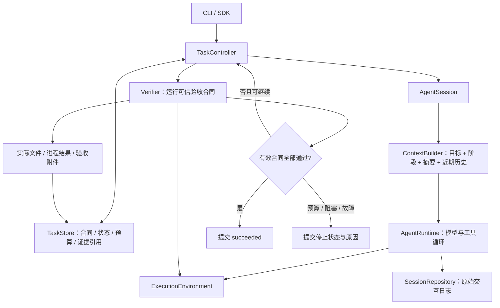

# 长任务处理方案

日期：2026-10-04。状态：**第一、第二阶段和验收 / 恢复补强已落地**。第二阶段原记录为 36 个关键契约测试和 26 个 E2E 分组通过，实际用法、报告和保守兼容边界见 [第二阶段实现](long-tasks-phase2-implementation.md)；本轮新增用例及结果见 [补强实现](long-tasks-hardening-implementation.md)。上下文投影、全局预算和无进展重规划仍待后续实施，具体实际任务与验收见 [第三阶段 E2E 规格](long-tasks-phase3-e2e.md)。

第二阶段遵循先定义 [恢复与控制 E2E](long-tasks-phase2-e2e.md)、再设计 [恢复、版本与用户控制方案](long-tasks-phase2.md)、实现并实际验收的顺序。LT-10 已验证不同工程结构。第二阶段的提交协议、执行权和迁移细节以专门文档及实现记录为准。

本方案先定义 [长任务 E2E 用例](long-tasks-e2e.md)，再设计相应机制。目标是让当前 TypeScript Code Agent 跨阶段、跨上下文和跨进程可靠完成实际任务，并能说明完成依据或停止原因。本文保留完整方案与接口草案；现有能力以 [初版实现](implementation.md) 和 [第一阶段实现](long-tasks-implementation.md) 为准。

## 1. 从实际用例推导需求

以订单处理 CLI 为主用例：解析 CSV、计算订单金额、生成 JSON，逐阶段验证，最终从真实 CLI 独立验收。长任务能力需要回答四个问题：现在要完成什么、实际已经完成什么、中断后可以安全继续什么、什么时候应当停止。

| 设计要求 | 对应 E2E | 可观察的结果 |
| --- | --- | --- |
| 持久目标、阶段和验收合同 | LT-01、LT-07 | 重启或需求变更后仍按有效合同交付 |
| 完成前独立验证，失败后有限继续 | LT-02 | 模型说完成时，坏代码仍会被发现并修复 |
| 历史与请求上下文分离 | LT-03 | 压缩后保留早期约束，真实模型协议可用 |
| 任务恢复与副作用核查 | LT-04 | 已发生的操作不重复，未知结果不被当成未执行 |
| 全任务预算与无进展控制 | LT-05、LT-06 | 恢复不重置预算，重复失败有明确停止原因 |
| 用户输入持久化、取消、单执行者 | LT-07、LT-08 | 输入不重复应用，取消后不自动运行，无并发写入 |
| 验收和存储故障分类 | LT-09 | 无证据或无法提交时不会虚报成功 |
| 通用工作区与不同产物入口 | LT-10 | 不依赖 src / 订单 CLI，真实 HTTP 服务暂停恢复后仍正确 |

## 2. 当前基础与缺口

当前 `AgentRuntime` 已实现“模型请求 → 工具调用 → 工具结果 → 下一轮”，`AgentSession` 负责会话、输入和恢复，`SessionRepository` 保存 JSONL 历史，工具执行前提交 intent。普通聊天恢复补充中断说明；持久任务先查询回执或核对文件后置条件，未知效果阻塞续跑，两者均不自动重放副作用。

第一阶段已提供持久任务、阶段状态、独立验收和有限修复；第二阶段已提供输入对账、合同更新、持久控制和 Windows 执行权 / 进程托管。本轮补强成功提交前核查和暂时无法读取文件 / 回执的恢复分类。当前仍有以下缺口：

- `RunResult.status === "completed"` 本身没有业务验收语义；持久任务已由 `TaskController` 的独立验收补齐，普通聊天仍需宿主核验结果。
- 历史在 `run()` 开始时复制，之后不断增长；尚无每次请求前的上下文投影和压缩入口。
- `maxTurns` 每次 Run 重新计算。`maxRuns` / `maxRepairs` 已跨进程累计，但尚无覆盖普通执行、摘要和重规划的全局模型请求账本。
- 普通聊天的 follow-up / steering 队列仍在内存中；持久任务已有输入和控制命令对账，仍缺少无进展检测及策略调整。
- 持久任务恢复已使用 Windows 内核执行权；普通聊天 v1 锁仍需异常退出后人工确认处理，其他平台的持久任务恢复尚未实现。

源码依据：[执行循环](../src/runtime/agent.ts)、[会话 Harness](../src/harness/session.ts)、[会话存储](../src/storage/session.ts)、[工具执行器](../src/tools/executor.ts)。现有 [短任务 E2E](e2e.md) 可继续作为回归基线。

## 3. 参考项目与取舍

本次研究核对官方仓库固定提交，避免把不同版本的行为混在一起。提交时间为 UTC；本次查阅日期为 2026-10-04。下列结论来自官方文档与相应源码快照的阅读，没有在本工程中运行这些项目验证。

| 项目 | 固定提交 / 版本信息 | 已核实的相关设计 | 本工程取舍 |
| --- | --- | --- | --- |
| pi | `a276dabe57911253350bffb93cb7d7aff6a73261`；提交于 2026-10-02 22:14:52；对应包版本 `1.0.0` | Coding Agent 在下一模型轮次前压缩，保存摘要和 `firstKeptEntryId`，原始历史保留 [P1] | 采用会话历史与上下文投影分离、成组保留工具交互；任务验收另设控制器 |
| pi-durable | 同一 pi 提交；独立实验性包 | 持久状态机、提交后再执行、输入 `requestId` 去重、工具 `safe / never` 恢复策略 [P2] | 参考提交边界和恢复语义，暂不引入其任务调度依赖；它不等于当前 Coding Agent 已自带全部 durable 功能 |
| DeepSeek Harness | `5badb15009ae1756c3afe0ae0cef1faafc290ccc`；提交于 2026-10-03 03:48:13；根包 `0.2.1-alpha.1` | Cordis 插件组合；会话事件日志派生模型历史；loop 生命周期扩展；持久 inbox 与未知工具结果恢复 [D1–D3] | 保留可替换接口和请求前 / 停止前钩子；初期使用普通 TypeScript 依赖注入，避免为长任务先迁移整套插件框架 |
| Hermes | `e67255e7e4baec0d01c08a1e81e31223528522d4`；提交于 2026-10-03 04:11:01；`pyproject.toml` 版本为占位 `0.0.0`，因此以提交标识版本 | 持久目标与 completion contract；quality gate；上下文引擎、结构化摘要与历史恢复；SQLite 状态 [H1–H3] | 采用持久合同和阶段续接；代码任务优先由独立程序验收。模型 judge 可辅助分析，不具有单独判定成功的权力 |

Hermes 的 `/goal resume` 可以重置续接轮次，judge 出错时也可继续；DeepSeek 默认 loop 文档明确没有内建 turn budget [H1、D2]。本工程选择全任务累计预算，并在验收不可用时停止成功判定。这是本工程的取舍，不是对参考项目能力的泛化结论。

## 4. 总体结构：任务控制器驱动现有 loop

初期采用单 Agent、单机持久化和显式恢复。一个任务固定绑定一个工作区和一个会话，不要求多 Agent、后台常驻服务或完整 DAG 调度器。



`Task` 是用户目标及其完成合同，生命周期可以跨进程；`Session` 是模型交互的持久历史；`Run` 是一次执行片段，仍沿用现有 `RunResult`。同一个 Task 可以有多个 Run，一个 Run 可以包含多个模型请求和工具批次。本工程现有代码把一次模型请求称为 turn；DeepSeek 的 step / turn 命名不同，统计时不能直接混用。

图中的 `ContextBuilder` 仍是后续方案，尚未实现；当前预算只包含已落地的 Run / 修复额度和每个 Run 的轮次限制。下文接口与上下文 / 全局预算 / 停滞设计继续作为草案，不能据此认定能力已通过验收。

`TaskController` 负责选阶段、恢复、验证和是否继续。`AgentRuntime` 保持通用工具循环，不承担规划数据库、业务验收或任务调度。阶段通过专门的验收器推进，模型可以提出计划和下一步建议。

### 4.1 任务状态

| 状态 | 含义与后续行为 |
| --- | --- |
| `pending` | 合同已提交，尚未执行 |
| `running` | 正在执行一个 Run；持久字段记录关联 run ID |
| `verifying` | 正在验收；验收结果未提交前不视为通过 |
| `recovering` | 核对进程中断、未知工具结果与工作区变化 |
| `paused` | 用户显式暂停，或宿主在阶段边界主动暂停；不会自动续跑 |
| `blocked` | 缺少必要输入、未知副作用无法查询、验收不可用等，等待可观察的条件变化 |
| `budget_exhausted` | 全任务额度用尽；恢复本身不增加额度 |
| `succeeded` | 当前合同及其约束通过最终验收，有有效证据 |
| `cancelled` | 用户停止请求已处理；同一任务不自动恢复执行 |
| `failed` | 无法恢复的执行或状态错误；保存可诊断原因 |

常规路径为 `pending → running → verifying → running / succeeded`。打开遗留的 `running / verifying` 状态时，先进入 `recovering`，不能直接认为上次动作尚未发生。

`paused / blocked` 只能由宿主显式恢复；`budget_exhausted` 必须先有带审计记录的额度调整。`succeeded / cancelled / failed` 结束当前任务；新需求可创建后继任务，保留对旧任务的引用。活动任务的需求更新则产生新的合同版本。不能用追加一句“继续”绕过取消、预算或版本限制。

## 5. 持久任务合同与验收证据

### 5.1 数据职责

以下是语义草案，不直接替换现有 `contracts.ts`：

```typescript
type TaskStatus =
  | "pending" | "running" | "verifying" | "recovering"
  | "paused" | "blocked" | "budget_exhausted"
  | "succeeded" | "cancelled" | "failed";

interface TaskSpec {
  id: string;
  version: number;
  sessionId: string;
  workspaceRoot: string;
  outcome: string;
  constraints: readonly string[];
  milestones: readonly {
    id: string;
    dependsOn: readonly string[];
    verificationIds: readonly string[];
  }[];
  finalVerificationIds: readonly string[];
  verifierManifestHash: string;
  budget: {
    modelRequests: number;
    activeMilliseconds: number;
    repairCycles: number;
  };
}

interface VerificationEvidence {
  id: string;
  taskId: string;
  specVersion: number;
  verificationId: string;
  inputFingerprint: string;
  artifactHashes: Readonly<Record<string, string>>;
  result: "passed" | "failed" | "unavailable";
  reportArtifact: string;
  sessionCursor: string;
  observedAt: number;
}
```

具体命令、参数、工作目录、超时、输入文件和输出检查放在宿主注册的 `VerificationSpec` 中，由 `verificationId` 引用。使用结构化 `command + args`，避免从模型文本拼接验收 shell。合同由用户任务及可信测试规格生成，模型提出的分解不能删除验收条件或修改真正的验收器。

规划与完成状态分开：`milestone_proposed` 只是建议，`milestone_verified` 必须引用有效证据。纯读诊断任务也应有可检查的产物合同；暂时没有可执行验收规则的目标只能标记“待验证”，不能使用本方案的自动 `succeeded`。

### 5.2 存储方案

首阶段在现有 JSONL 存储旁新增任务日志，暂不引入数据库：

```text
<state-root>/
  tasks/<task-id>/
    events.jsonl              任务控制事实，权威来源
    snapshot.json             加速读取的派生缓存，可重建
    commands/                 跨进程控制命令的持久投递目录
    evidence/<evidence-id>/   脱敏报告、输出摘要和验收元数据
    owner.lock                单执行者信息
  sessions/<session-id>.jsonl 原始模型交互，继续由 SessionRepository 管理
```

事件带 `schemaVersion、taskId、seq、eventId、timestamp`，以及相关 `specVersion、runId、sessionCursor`。主要事件包括合同创建 / 更新、输入接收 / 应用、Run 关联、预算预留 / 结算、验收开始 / 结果、阶段通过、摘要引用和任务状态变更。

单任务串行追加并 `fsync`，提交成功后再改变内存状态和发布确定性状态事件。快照通过临时文件原子替换，附带日志水位；快照丢失或过期不改变任务事实。报告附件先落盘，再提交包含摘要的引用；崩溃产生的孤立附件不参与验收。

执行进程独占任务日志，其他 CLI 进程通过 `commands/` 投递带唯一 ID 的不可变命令文件，原子创建并同步后得到“已投递”收据。执行者串行记录接收与处理结果，并在安全边界优先处理用户控制命令；文件通知只负责唤醒，低频补查防止漏通知。CLI 只有观察到持久处理结果后才报告“已暂停 / 已取消”。对已经结束的任务，记录拒绝结果；投递成功不等于命令已经生效。

任务日志与会话日志是两个文件，**不假定跨文件事务**。在启动 Run 前先提交稳定 `runId / inputId`，会话接受输入时持久记录这两个标识，再在任务日志标记已应用。恢复时按标识对账：会话已有该输入就复用，未提交才补写。同一输入 ID 携带不同内容须报冲突。这个协议去重输入交接，不能保证外部工具副作用恰好发生一次。

当前会话 schema 为 1，已有 run_status.runId，但缺少稳定输入关联、工具 operation ID 和压缩条目；新增能力需要 schema 2。读取旧格式后创建新代际文件并记录来源，不原地破坏原文件；拒绝未知未来版本。现有短任务会话不凭空生成已经通过的任务验收。第二阶段的迁移 manifest、输入对账及旧活动任务阻塞规则见 [存储升级](long-tasks-phase2.md#4-数据与存储升级)。

### 5.3 验收如何判定

1. 读取当前合同、验收器版本、项目指令及相关源码 / 输入 / 配置的内容摘要，建立本次验收输入指纹。
2. 用同一执行环境后端启动可信验收程序，清理模型密钥，设置超时和输出上限；保留完整输出为附件。
3. 检查程序实际执行、非空有效报告、关键结果文件以及合同约束。测试命令需验证确有测试执行，不能把“零个测试、退出码 0”当成完成。
4. 检查验收期间输入是否变化，保存输出文件摘要。如果发生无法归因的变化，本次结果失效并重新核查。
5. 提交证据后才标记阶段通过。成功提交前再处理已接收的用户输入与停止命令，并检查合同版本仍一致。最终必须重新执行最终合同；恢复、换需求或源码变化后，旧证据只能用作历史线索。

指纹应覆盖验收依赖的源文件、配置、锁文件、测试和输入数据，排除仅用于日志与生成输出的目录；输出单独记录摘要。初期使用显式清单，无法确认依赖范围时保守扩大到项目文件。mtime 或模型“没有改过”的声明不能替代内容摘要。

多进程文件检查不能提供完整文件系统快照保证。第一版只支持协调中的单一任务执行者；其他软件修改文件时尽量通过前后摘要检测并使证据失效。需要更强一致性时，再由隔离工作区或快照执行后端实现。

## 6. 任务推进流程

在订单任务中，控制器依次选择 M1 / M2 / M3；模型在每个阶段内自行读取、修复和测试。所有阶段具备可执行验收，不按聊天条数切分工作。

```text
创建 / 恢复任务
→ 获取任务和会话执行权，校验合同、工作区、配置、权限与预算
→ 恢复未提交结果、对账输入和 Run，检查旧证据是否有效
→ 为下一阶段构建上下文
→ 执行一个有边界的 Agent Run
→ 在安全边界独立验收
→ 通过：提交证据、推进阶段，最后进行全量验收
→ 不通过：提交失败诊断，判断新进展、修复额度与可用预算
→ 可继续：追加结构化反馈并开启下一 Run
→ 不可继续：提交停止状态、原因和剩余事项
```

`completed` 或安全让出的 Run 进入正常验收。现有 Run 的 `budget_exhausted` 可能仅表示片段达到 `maxTurns`；实现时增加结构化终止原因，区分 `turn_limit` 与全任务额度耗尽。若只是片段上限且工具组已结算，先验收，再由控制器按剩余全局预算决定续接，不能误标成整个任务失败。`aborted / failed` 分别交给取消与恢复策略。后续可增加专门的 `yielded` 状态表达阶段让出。

验收失败反馈携带失败条件、证据引用、已确认事实和待解决项；不给模型只发送泛化的“继续”。验收通过后提供下一阶段合同，不重复发送全部旧工具输出。模型可通过宿主注册的 `request_verification` 工具请求提前验收；只有控制器能写入通过状态。

用户需求输入按唯一 ID 先持久化，再在安全边界应用，优先于自动续接。影响合同的输入提高 `specVersion` 并使相关证据失效；一般澄清仍保存来源和应用记录。输入 ID 的去重不能按文本内容替代，不同时间的同一句需求可能是两个合法操作。

## 7. 上下文管理

### 7.1 每次请求重新投影

新增 `ContextBuilder`，每次模型请求前从持久事实构建：

```text
当前系统指令与工具声明
+ 有效用户目标、约束和合同版本
+ 当前阶段合同、已验证进度与最近失败
+ 带来源范围的历史摘要
+ 完整保留的近期 assistant / 工具调用 / 结果组
+ 已持久化且尚需处理的用户输入
```

在 `RuntimeServices` 增加请求准备钩子，替代 `run()` 内一份持续增长数组直接用于所有请求的做法。投影结果不能再次当成普通聊天全文追加，导致每轮重复；记录投影版本、原始条目区间、任务版本和请求配置，保证事后可重建。完整历史仍留在 `SessionRepository`。

当前适配器依赖 assistant 的原生 `providerData`，包括 thinking 等协议数据。保留区间内的 assistant 消息必须原样保留该字段；摘要以带明确来源的普通上下文消息注入，不伪造原生 assistant 签名。

### 7.2 何时与如何压缩

请求容量 `C` 来自模型适配器已核实的元数据或显式配置，记录来源；为输出与估算误差预留 `R`。当预计请求接近 `C - R` 时，在已提交完整工具批次的边界压缩。测试可调低阈值，不假设当前 MiMo 窗口容量。

先将旧的大工具输出投影为短诊断与附件引用，再选择历史前缀生成结构化摘要。摘要包含相关决策、文件位置、已知失败和后续线索；用户目标、合同、预算与已通过阶段由任务记录机械注入，不依赖摘要模型回忆。读取当前源码后才能判断文件现状。

保留最近完整工具组，不留下孤立工具结果；切点不能跨越未结算调用。摘要记录来源起止条目、保留起点和原摘要 ID。历史检索工具按条目 ID / 文件路径查询原日志与附件，受现有权限、敏感信息过滤和输出上限约束；工作区 `read_file` 不能直接读取工作区外的状态目录。

摘要调用同样消耗任务预算，并预先检查摘要模型容量。摘要失败、为空或没有可用切点时保留旧投影；可安全减少可选材料并重试一次，仍超限则 `blocked: context_capacity_exceeded`。不能因摘要失败丢掉旧目标和历史再继续运行。供应商明确上下文超限后，最多进行一次不同投影的恢复请求，禁止相同超限请求无限重发。

只在必要时压缩，稳定保留系统指令与既有前缀；不每轮改写摘要。这有利于模型继续理解工作，也避免无必要的前缀变化。摘要是可追溯的线索，独立验收证据始终拥有更高的完成判定权。

对应验证：LT-03，包括摘要失败和必要上下文本身过大的边界变体。

## 8. 中断、恢复与取消

### 8.1 提交边界与恢复动作

| 中断位置 | 已知事实 | 恢复策略 |
| --- | --- | --- |
| 模型预算预留前 | 没有请求获准发出 | 可在预算允许时启动 |
| 请求已获准，最终响应未提交 | 请求可能已计费，没有可信完整响应 | 保留额度占用，标记 usage 未知；有限重新请求，不从半截响应执行工具 |
| assistant 调用已提交，工具 intent 尚未提交 | 按执行契约，工具尚未启动 | 补齐未执行结果，由模型按当前状态重决策 |
| 工具 intent 已提交，结果未提交 | 副作用未知 | 先检查文件 / 外部可查询状态，不自动重复写入或进程操作 |
| 工具结果已提交，阶段状态未更新 | 工具事实存在，阶段验收尚未确认 | 从日志对账，重新取得验收证据 |
| 验收完成，结果记录未提交 | 内存中的结果不可作为持久通过事实 | 校验已有附件并重新验收，不直接推进阶段 |
| 最终通过证据与成功事件均已提交 | 当前版本曾成功 | 展示历史成功；变化后的新目标使用新版本或后继任务 |

`replay: safe` 只允许重新做无副作用的读取，或工具提供明确幂等协议的动作；它不保证重读得到旧结果。默认 `write / edit / shell` 维持 `never`。可查询工具使用稳定操作 ID 对账；没有可查询结果且重复有风险时，停为 `blocked: effect_unknown`。不把持久状态机误称为外部操作的 exactly-once 执行。

为 LT-04 增加宿主注册的可选 `ToolRecoveryAdapter`：以原始 call ID 和持久 intent 查询，返回 `completed + receipt`、`not_started` 或 `unknown`，查询本身不得重做副作用。核对有效回执后补交对应工具结果；无法确认就保留中断结果并阻塞。默认文件工具只能核对当前内容是否满足目标，不声称证明原调用的所有副作用；通用 shell 没有天然可查询回执。

### 8.2 取消与暂停

执行者接收任务停止请求并持久化后，再触发活动 `AbortController`；在活动工具执行期间也监听控制投递，不必等长工具自然结束才读取取消。后续模型请求和工具启动都检查停止标记；终止子进程树，记录仍可能存在的未知结果，最后提交 `cancelled`。取消不承诺撤销已经完成的文件修改或外部副作用。

暂停与取消不同：暂停在可提交边界停止并保留继续入口；取消结束当前任务。进程强退没有用户取消事件时，恢复仍需核查，不推断成用户主动放弃。

第一版不托管脱离进程的后台工具。任务需要长时间等待时，在有超时的前台工具中执行，或明确暂停等待外部输入；后续只有增加进程身份和结果收据合同、先补齐 E2E，才支持持久后台等待。

### 8.3 执行权与锁

第二阶段单执行者范围扩展到同一执行权注册目录中的规范工作区、Task 和 Session；不同 Task 不得同时修改同一工作区。按工作区 → 任务 → 会话的固定顺序获得执行权，并在每次启动外部动作前确认持有权。

第二阶段已实现 Windows 操作系统锁和进程托管。稳定锁文件不删除，句柄释放后才能取得执行权；所有者信息仅作诊断。有遗留 v1 所有者锁或执行历史无法对账时拒绝自动迁移。方案见 [执行权与进程托管](long-tasks-phase2.md#7-执行权与进程托管)，实际平台与验证边界见 [第二阶段实现](long-tasks-phase2-implementation.md)。

该协议需要同时升级现有会话锁。测试必须涵盖竞争与强退边界（LT-08），不能只测试“删除旧文件后能运行”。

## 9. 预算、无进展与错误分类

### 9.1 全任务预算

每个模型请求在调用 gateway 前持久预留一次额度，包括主模型、摘要和自动重试；usage 返回后结算。请求已预留但崩溃时，保守保留其占用。所有请求共用 BudgetGuard，适配器不另外开启隐藏自动重试。

执行片段可有 `maxTurns`，全任务还有模型请求数、活动时间和修复次数上限。恢复不会清零；额度调整必须是独立控制事件。活动时间采用每个执行阶段预留时限、结束后结算的方式；崩溃时未结算时限保持占用，离线暂停时间不冒充有效工作时间。每个子进程和模型请求也有独立超时，最后一个在途动作使用剩余额度限制超时。

请求数与宿主时间上限是可执行边界；token / cost 只有供应商返回 usage 后才可准确结算。若添加金额或 token 上限，使用输入估算与输出上限预留，报告未知用量及可能的估算偏差；不能声称能够精确限制供应商的最终账单。

模型额度到达上限后不再启动新模型请求或 Agent 工具。可以执行事先预留、受独立超时约束的一次最终验收；若没有该预留或其他全局额度已耗尽，就返回 `budget_exhausted` 并保留最近证据。验收不是绕过预算的新修复循环。

配置初始值在实现 LT-01 / LT-05 时根据真实 MiMo 运行测量，不把文档中的示例当成已验证的通用最优值。

### 9.2 什么算进展

可靠进展包括：新的阶段合同通过；失败验收条件确实减少；取得可核对的新诊断并改变后续尝试。改了更多文件、写了更长回复、反复执行相同失败命令都不能单独证明进展。

控制器在 Run / 验收边界记录：合同版本、通过集合、规范化失败指纹和所尝试策略。连续若干边界没有能力进展且重复同类失败时，允许有限重规划；超过额度后进入 `blocked: no_progress`，输出已尝试策略和具体缺失条件。诊断数量与模型自称“发现新问题”只能是辅助信号，必须关联可查证的文件或结果。

无进展窗口、重规划次数是配置项。新需求版本或实际新增通过条件重建窗口，但不重置总预算。即使检测器误判，总预算也必须独立终止任务。LT-06 同时验证重复失败能停止与真实进展不会被误停。

### 9.3 错误处理

| 错误 | 行为 |
| --- | --- |
| 代码验收失败 | 提交失败证据，预算允许时反馈修复 |
| 明确缺少必要输入或权限 | `blocked`，记录所需条件；不绕过工具权限 |
| 模型暂时性传输失败 | 共享额度内有限退避，每次尝试计数 |
| 上下文超限 | 安全压缩与一次恢复；仍失败则阻塞 |
| 验收器或测试基础设施不可用 | `blocked: verification_unavailable`，不将其当成代码缺陷或通过 |
| 任务 / 会话日志提交失败 | 停止外部动作，向宿主报告 `persistence_failed`；无法落盘时不能假称停止状态已持久化 |
| 中间日志损坏或未来 schema | 拒绝继续，保留原始证据并报告失败 |

对应验证：LT-05、LT-06、LT-09。重试只作用于明确允许重试的步骤，不自动重放整个 Run。

## 10. 与权限和执行环境的关系

TaskController 与 Verifier 使用相同的 `ExecutionEnvironment` 抽象和有效权限配置。若 `--no-shell` 禁止进程执行，就必须选择不依赖 shell 的验收器，否则创建任务时报告合同与能力不匹配；不能借验收绕过用户限制。

当前 `LocalEnvironment` 对文件工具有路径边界，但 shell 仍以主机权限运行，**本方案不会自动产生沙箱**。恢复读取工作区、执行验证和保存状态都要如实记录所用后端。任务记录默认在目标工作区外，由 Harness 写入；在本地 shell 模式下，这只是职责边界。

未来可替换容器或其他隔离执行后端，让文件工具、shell 与验收共享同一工作区视图。此项需独立 E2E-first 设计，不作为首版长任务完成的前置依赖。首版也不承诺跨机器调度、非协作进程的完整防护或外部交易自动补偿。

## 11. 建议的实现位置与交付顺序

| 模块 / 修改点（完整方案，含待实现能力） | 职责 | 直接验证 |
| --- | --- | --- |
| `src/harness/task-controller.ts` | 阶段推进、任务状态、验收反馈 | LT-01、LT-02、LT-06 |
| `src/storage/task.ts` | 任务事件、快照、输入去重与证据引用 | LT-04、LT-07、LT-09 |
| `src/harness/verifier.ts` | 可信验收合同、报告及指纹 | LT-01、LT-02、LT-07、LT-09 |
| `src/harness/context.ts` | 请求投影、摘要与历史恢复 | LT-03 |
| `src/harness/budget.ts` | 所有模型请求及活动时间额度 | LT-05 |
| `src/storage/lock.ts` | 统一执行权、进程身份和接管 | LT-08 |
| `src/runtime/agent.ts` / `src/harness/session.ts` | 请求前钩子、稳定 run / input ID、安全让出与取消 | LT-03、LT-04、LT-07、LT-08 |
| `src/cli.ts` / `src/index.ts` | 任务入口与任务事件，保持现有聊天入口可用 | LT-01、LT-08 |

CLI 已提供 `task start --spec <path>`、`task status <id>`、`task resume <id>`、`task pause <id>`、`task cancel <id>`、`task update` 与 `task command-status`，统一支持状态目录。实际参数、SDK、平台条件及验收记录见 [第二阶段实现](long-tasks-phase2-implementation.md)。

任务事件使用持久 `seq` 与 `taskId / specVersion / runId`；已有 Agent 流事件仍保留独立的 run 内序号。CLI 任务退出码由 Task 状态决定，不能因为最后一个 Run 是 `completed` 就返回任务成功。

交付分四步，每步先落实对应测试，再写实现并运行真实 E2E：

1. **任务与验收闭环（已完成）**：完成合同、TaskStore、Verifier 和阶段推进；LT-01 / LT-02 通过，现有 4 个 E2E 回归通过。
2. **恢复与用户控制（已落地）**：输入交接、版本失效、未知结果核查、执行权与取消；LT-04 / LT-07 / LT-08 和 LT-10 已实际验证，迁移采用保守边界。见 [第二阶段实现与 26 个分组通过记录](long-tasks-phase2-implementation.md)。
3. **上下文与资源边界**：每次请求投影、摘要、历史检索和全任务预算；通过 LT-03 / LT-05。
4. **无进展与故障诊断**：有限重规划、基础设施分类、持久化失败停止；通过 LT-06 / LT-09，保存完整长任务报告。

单元测试只补充协议配对、状态合法转移、预算不变量和输入去重等关键确定性能力，不镜像全部内部字段。新能力是否完成由对应真实 E2E 结果决定；第一阶段验证结果见 [实现记录](long-tasks-implementation.md)。

## 12. 固定参考来源

- **P1**：[pi 压缩设计](https://github.com/earendil-works/pi/blob/a276dabe57911253350bffb93cb7d7aff6a73261/packages/coding-agent/docs/compaction.md)、[SessionManager 源码](https://github.com/earendil-works/pi/blob/a276dabe57911253350bffb93cb7d7aff6a73261/packages/coding-agent/src/core/session-manager.ts)。
- **P2**：[pi-durable 官方说明：提交、状态机、requestId 与 replay](https://github.com/earendil-works/pi/blob/a276dabe57911253350bffb93cb7d7aff6a73261/packages/durable/README.md)。
- **D1**：[DeepSeek Harness 架构与 Cordis 插件组合](https://github.com/deepseek-ai/deepseek-harness/blob/5badb15009ae1756c3afe0ae0cef1faafc290ccc/docs/architecture.md)、[根包版本](https://github.com/deepseek-ai/deepseek-harness/blob/5badb15009ae1756c3afe0ae0cef1faafc290ccc/package.json)。
- **D2**：[DeepSeek Agent Loop：inbox、停止与失败恢复、预算限制说明](https://github.com/deepseek-ai/deepseek-harness/blob/5badb15009ae1756c3afe0ae0cef1faafc290ccc/packages/core/agent-loop/README.md)。
- **D3**：[DeepSeek Session：日志投影与持久提交屏障](https://github.com/deepseek-ai/deepseek-harness/blob/5badb15009ae1756c3afe0ae0cef1faafc290ccc/packages/core/session/README.md)。
- **H1**：[Hermes 持久目标：completion contract、quality gates 与预算语义](https://github.com/NousResearch/hermes-agent/blob/e67255e7e4baec0d01c08a1e81e31223528522d4/website/docs/user-guide/features/goals.md)。
- **H2**：[Hermes 上下文引擎、压缩与恢复](https://github.com/NousResearch/hermes-agent/blob/e67255e7e4baec0d01c08a1e81e31223528522d4/website/docs/developer-guide/context-compression-and-caching.md)。
- **H3**：[Hermes SQLite 会话存储](https://github.com/NousResearch/hermes-agent/blob/e67255e7e4baec0d01c08a1e81e31223528522d4/website/docs/developer-guide/session-storage.md)、[项目版本字段](https://github.com/NousResearch/hermes-agent/blob/e67255e7e4baec0d01c08a1e81e31223528522d4/pyproject.toml)。

本工程提出的状态机、验收指纹、跨文件对账与预算政策是结合当前实现和 E2E 需求形成的方案，不能当成三个参考项目都具备的相同行为。摘要质量、停滞窗口及状态存储性能仍待实现后的真实任务测量。
